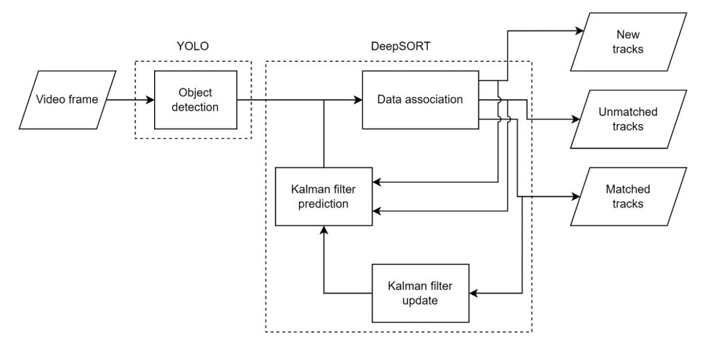

# YOLOv7 DeepSORT ReId Documentation

## Introduction

This documentation serves as a guide for developers on the integration of YOLOv7 and DeepSORT for Reidentification Task. It also provides the pretrained weights for a thermal reidentification dataset.

## Released Versions:

- **Pretrained-base v0.1**: The first release of the pretrained weight for thermal datasets.

## Architecture

This ReId algorithm is built with YOLO and DeepSORT on Python 3.7.16. The dependencies are listed inside the `requirements.txt` from the repo.

## Getting Started

### Minimum Requirements

As of February 2024, a minimum GPU that supports CUDA version 11.6 is needed for this.

### Installing Conda

To ease the configuration of Python and its dependencies, we will use [Conda](https://docs.conda.io/projects/conda/en/latest/user-guide/install/) for this. Important: The virtual environment used can be downloaded [here](https://github.com/chronomustard/YOLOv7-DeepSORT-Thermal/tree/main/env).

### Configuring Tensorflow and PyTorch

To allow the use of Tensorflow and PyTorch, respective CUDA and Cudatoolkit are required. Please refer to these respective guides for [CUDA (Windows)](https://docs.nvidia.com/cuda/cuda-installation-guide-microsoft-windows/index.html), [CUDA (Linux)](https://docs.nvidia.com/cuda/cuda-installation-guide-linux/index.html), [Tensorflow](https://pytorch.org/get-started/previous-versions/), and [PyTorch](https://pytorch.org/get-started/previous-versions/). For reference, in this project, I used tensorflow 1.15, pytorch 1.13+cu116 with torchaudio and torchvision. Please make sure that the environment variables are correctly configured.

### Datasets and Pretrained Weights

A market-1501-based custom dataset compiled from ThermalDB, RegDB, market-1501, and IndoThermal is used. The pretrained weights can be accessed from [this URL](#).

...

## DeepSORT-YOLOv7 Reidentification

### Configuration

The DeepSORT-YOLOv7 reidentification program is provided [here](#). To run the algorithm, download [this folder](https://drive.google.com/drive/folders/1lbdhDOpZ3475eekVQ2q2e7rsli2dffll?usp=sharing).

...

## References

- [Conda Documentation](https://docs.conda.io/projects/conda/en/latest/user-guide/install/)
- [YOLOv7-DeepSORT-Thermal Environment](https://github.com/chronomustard/YOLOv7-DeepSORT-Thermal/tree/main/env)
- [CUDA Installation Guide for Microsoft Windows](https://docs.nvidia.com/cuda/cuda-installation-guide-microsoft-windows/index.html)
- [CUDA Installation Guide for Linux](https://docs.nvidia.com/cuda/cuda-installation-guide-linux/index.html)
- [Get Started with PyTorch - Previous Versions](https://pytorch.org/get-started/previous-versions/)
- [YOLOv7 Custom Dataset Training Tutorial](https://blog.roboflow.com/yolov7-custom-dataset-training-tutorial/)
- [DeepSORT PyTorch](https://github.com/ZQPei/deep_sort_pytorch)
- [Market-1501 Dataset](https://www.kaggle.com/datasets/whurobin/market-1501)
- [YOLOv7-DeepSORT-Thermal Preprocessing Scripts](https://github.com/chronomustard/YOLOv7-DeepSORT-Thermal/tree/main/deepSORT_preprocessing_script)
- [YOLOv7-DeepSORT-Thermal](https://github.com/chronomustard/YOLOv7-DeepSORT-Thermal/tree/main)
- [Scalable Person Re-Identification: A Benchmark](https://openaccess.thecvf.com/content_iccv_2015/html/Zheng_Scalable_Person_Re-Identification_ICCV_2015_paper.html)

